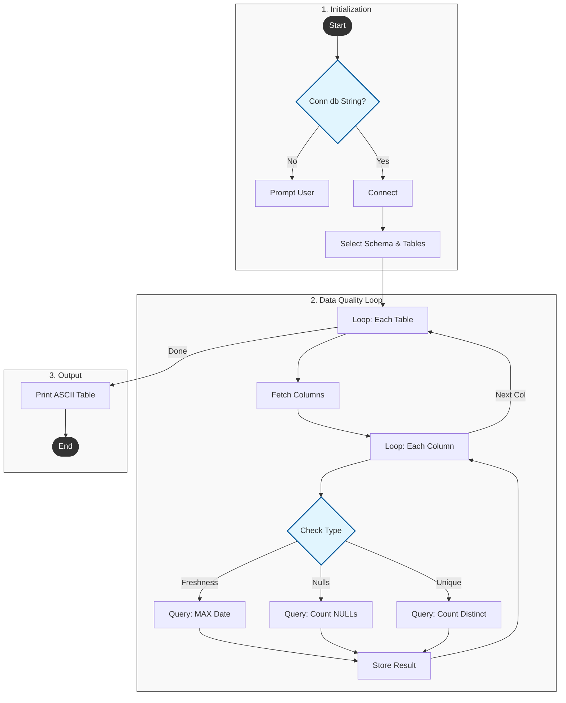

# 🏗️ System Architecture
{: .no_toc }

QualiDB is designed as a modular CLI application that bridges the gap between your raw database schema and Large Language Models (LLMs).

<details open markdown="block">
  <summary>
    Table of contents
  </summary>
  {: .text-delta }
- TOC
{:toc}
</details>

---

## 🧩 High-Level Design

The tool consists of three main components:
1.  **CLI Interface (Click):** Handles user commands, menus, and configuration.
2.  **Database Engine (SQLAlchemy):** Connects to BigQuery, Snowflake, or Postgres to fetch schemas and metadata.
3.  **AI Engine:** Interacts with Claude, Gemini, or OpenAI to generate business-context descriptions.


[Image of software architecture diagram]


---

## 🔄 Data Flow

### 1. Documentation Generation
When you run `generate-schema`, the data flows as follows:

1.  **Extraction:** The tool queries `information_schema` to get table and column names.
2.  **Prompting:** It constructs a prompt: *"Write a 1-sentence description for column 'created_at' in table 'orders'..."*
3.  **AI Processing:** The LLM returns a clean description (e.g., *"Timestamp when the order was placed."*).
4.  **Storage:** The result is saved to a local `models/schema.yml` file for review.

### 2. Data Quality Checks
When you run `check-quality`:

1.  **Introspection:** The tool detects column types (e.g., finds all `TIMESTAMP` columns).
2.  **Query Generation:** It builds SQL queries dynamically:
    ```sql
    SELECT MAX(ingested_at) FROM `project.dataset.table`
    ```
3.  **Analysis:** It compares the result against thresholds (e.g., > 24 hours old).
4.  **Reporting:** Results are printed to the terminal in an ASCII table.

**Flow Diagram:**

**Flow Diagram:**


## 🛠️ Technology Stack

| Component | Library/Tool | Purpose |
| :--- | :--- | :--- |
| **Language** | Python 3.10+ | Core logic |
| **CLI** | `click`, `questionary` | Interactive menus and flags |
| **Database** | `sqlalchemy` | Unified interface for SQL DBs |
| **AI** | `anthropic`, `openai` | API wrappers for LLMs |
| **Testing** | `pytest` | Unit and integration testing |